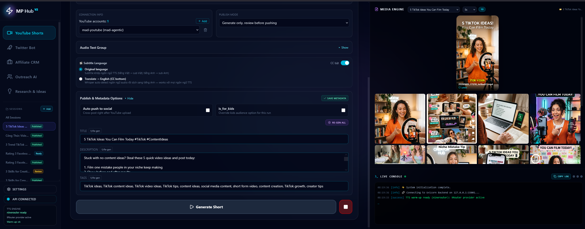
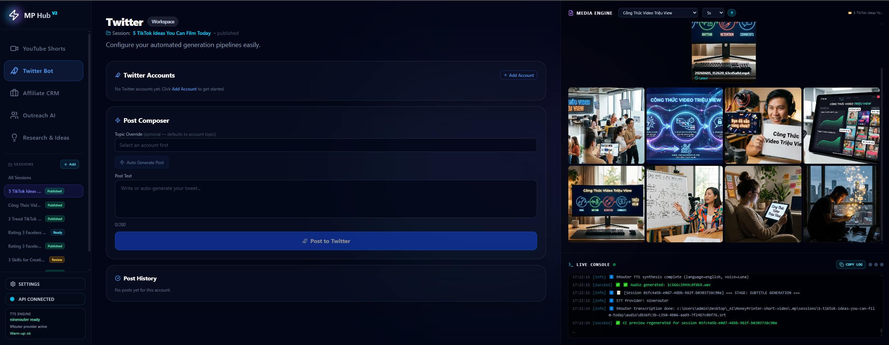
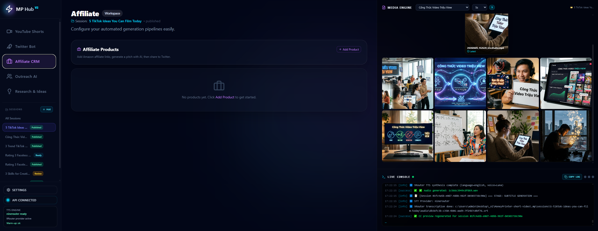

# MoneyPrinter — 1-Click Short Video Automation Hub

> **From idea to published YouTube Short — fully automated, 100% local, near-zero cost.**

MoneyPrinter is a local-first automation platform that turns a single idea into a finished vertical video and publishes it to YouTube, Twitter/X, TikTok, and Instagram — all from one dashboard, with one click.



---

## Why MoneyPrinter?

Most "AI video" tools charge $30–$100/month per seat, lock you into their cloud, and still need you to babysit every step. MoneyPrinter is different:

- **Run everything on your own machine.** No cloud bills, no per-render fees.
- **No paid API required.** Use local Ollama models, KittenTTS, and local Whisper — or plug in any OpenAI-compatible endpoint (9Router, LiteLLM, LM Studio) if you want more power.
- **One click = full pipeline.** Research → Script → Images → Voice → Subtitles → Video → Upload. No tab-switching.
- **Multi-platform publishing.** Compose once, push to YouTube Shorts, Twitter/X, TikTok, and Instagram automatically.
- **You stay in control.** Manual review gate before publish. Edit any step, regenerate any stage, keep every session resumable.

---

## The 1-Click Pipeline


Pick a topic. Press **Generate Short**. That's it.

| Stage | What happens | Default engine |
|---|---|---|
| 1. Research | Pulls trending ideas and angles from the web | 9Router `search-combo` |
| 2. Script | Writes a hook → body → CTA short-form script | Ollama / OpenAI-compatible |
| 3. Images | Generates 9:16 scene images for every beat | Gemini image preview |
| 4. Voice | Reads the script in the chosen language/voice | KittenTTS / Edge-TTS / Gemini TTS |
| 5. Subtitles | Transcribes audio into timed `.srt` captions | Whisper / Gemini STT |
| 6. Compose | Stitches 1080×1920 MP4 with music + captions | MoviePy + ImageMagick |
| 7. Publish | Uploads to YouTube + cross-posts to socials | Selenium automation |

Every stage writes to a session folder, so if anything fails you can resume or regenerate from the broken step — no lost work.

---

## Feature Tour

### YouTube Shorts Workspace


- **Custom Subject** + **Audio Language** selectors
- **Auto Build** button writes the full script
- Live **Script Editor** with manual tweaks
- **Draft CC** from text + **Real CC** from final audio
- **Media Engine** gallery for image review and manual swaps
- **Generation Progress** panel with per-stage regenerate

### Research & Ideas Chat


A chat workspace that researches trends, brainstorms video ideas, and pushes the winning idea straight into a YouTube session. No more copying between tabs.

### Twitter/X Manager


- Add multiple X accounts
- Compose + schedule posts from the dashboard
- Pulls recent post history per account

### Affiliate CRM


- Amazon product scraping
- Auto-generated affiliate pitches
- One-click push to Twitter

### Runtime + LLM Settings


- Pick your LLM backend (Ollama, 9Router, OpenAI-compatible, custom proxy)
- Pick image / TTS / STT / search models independently
- Enable **fallback to local** so the app never blocks on a missing key
- Tweak FFmpeg CRF, browser profile, FireFox automation paths

---

## Cost Comparison

| Tool | Monthly cost | Local? | 1-click? |
|---|---|---|---|
| **MoneyPrinter** | **$0** (or your own LLM endpoint) | ✅ | ✅ |
| OpusClip / Vizard | $30–$60/mo | ❌ | partial |
| Pictory / InVideo | $25–$75/mo | ❌ | partial |
| Manual editing | "free" + 4 hrs/video | — | ❌ |

You bring the hardware (a Windows PC + Python 3.12 + Firefox). We bring the pipeline.

---

## Quick Start (Windows)

Use this path when you only want to run the app.

```powershell
# 1. Clone & enter
git clone https://github.com/mad-agentic/MoneyPrinter-short-video.git
cd MoneyPrinter-short-video

# 2. Copy config
copy config.example.json config.json

# 3. Install everything (Python venv + npm)
setup.bat

# 4. Launch the hub
start_hub.bat
```

Open **http://localhost:5174** and you are live.

Need the full local setup guide? Read [`docs/PROJECT_USAGE_VN.md`](docs/PROJECT_USAGE_VN.md).

> Backend API: `http://127.0.0.1:15001` · Frontend UI: `http://localhost:5174`

---

## Requirements

| Dependency | Purpose | Required? |
|---|---|---|
| Python 3.12 | Backend + video pipeline | ✅ |
| Node.js 18+ | React frontend | ✅ |
| Firefox + Selenium profile | Auto-upload to YouTube / X | For publishing |
| ImageMagick 7.x | Subtitle rendering | ✅ |
| FFmpeg | Encode audio/video | ✅ |
| Ollama **or** any OpenAI-compatible endpoint | LLM scripting | At least one |
| 9Router / Gemini API | Recommended image + TTS + STT + search | Optional, with local fallback |

**Minimum: 0 paid API keys.** The app is wired to fall back to fully local models at every stage.

---

## Full Setup Checklist

1. Install prerequisites:
   - Python 3.12
   - Node.js 18+
   - FFmpeg
   - ImageMagick 7.x
   - Firefox, if you want browser-based YouTube/X publishing
2. Copy `config.example.json` to `config.json`.
3. In `config.json`, set at least:
   - `imagemagick_path`
   - LLM provider settings, for example Ollama or OpenAI-compatible/9Router
   - image, TTS, STT, and search models if you use provider routing
4. Run `setup.bat` once to create the Python virtual environment and install frontend packages.
5. Run `start_hub.bat` for normal use.
6. Open `http://localhost:5174`.
7. In Settings, verify provider, model, voice, ImageMagick, FFmpeg, and browser paths before generating or publishing.

Manual debug commands:

```powershell
# Backend only
cd src
..\venv\Scripts\python.exe -m uvicorn api.main:app --port 15001 --reload

# Frontend only
cd frontend
npm run dev -- --host 127.0.0.1 --port 5174
```

Do not commit local runtime files: `config.json`, `.env`, `.mp/`, browser profiles, generated media, `venv/`, or `frontend/node_modules/`.

---

## Project Structure

```
src/
  api/             FastAPI backend (port 15001)
    main.py        /system endpoints
    youtube.py     /youtube video pipeline
    twitter.py     /twitter posting
    affiliate.py   /affiliate products
    session_manager.py
  classes/         YouTube / Twitter / AFM / Tts / Outreach / PostBridge
  providers/       9Router, Ollama, OpenAI-compatible adapters
frontend/          React 19 + Vite (port 5174)
docs/              Screenshots, skills, this GitPage site
.mp/sessions/      Per-video session files (auto-resume state)
```

---

## Multi-Platform Publishing

Compose once. Publish to:

- **YouTube Shorts** — full Selenium automation, scheduled, manual-review gate
- **Twitter/X** — auto-tweet from the same content
- **TikTok + Instagram** — via PostBridge cross-poster
- **Affiliate links** — Amazon product pitches auto-pushed to X

---

## Why "Local-First" Matters

- **Privacy.** Your scripts, account logins, and unreleased videos never leave your machine.
- **Cost.** No per-render fees, no seat licenses, no surprise overage bills.
- **Speed.** No upload-to-cloud, no waiting in a render queue.
- **Resilience.** No "service temporarily unavailable" mid-pipeline.
- **Composability.** Swap in any local model, any proxy, any voice — it's just config.

---

## Screenshots Index

| Screenshot | Description |
|---|---|
| `1clickGeneratetovideo.png` | Main YouTube workspace — 1-click generation |
| `Info Step123.png` | Script editor + audio text + language selector |
| `info step456.png` | CC draft, image engine, generation progress |
| `Generatiom progress.png` | Live pipeline progress + media gallery |
| `Research.png` | Research & Ideas chat workspace |
| `Twitter.png` | Twitter/X multi-account manager |
| `Afiliate.png` | Affiliate CRM + product pitches |
| `setting llm.png` | LLM backend + model selection |
| `setting runtime.png` | Runtime + browser + encoding settings |

---

## License

MIT — bring your own models, your own proxies, your own workflows. Use freely.
