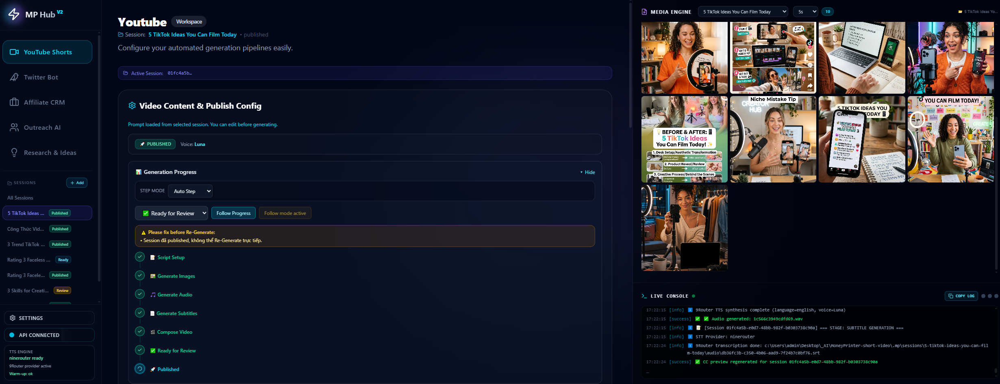
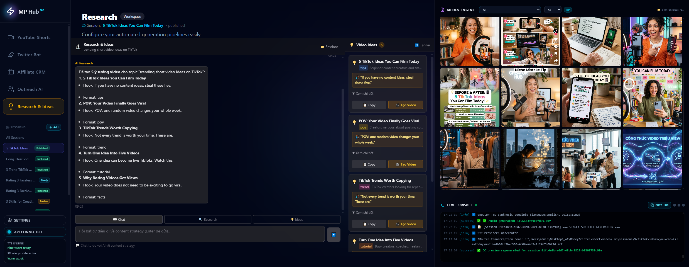
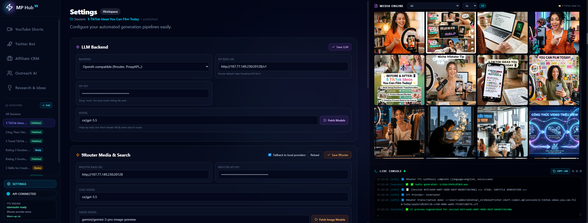

# MoneyPrinter Short Video

Local-first short-video automation hub for researching ideas, writing scripts, generating images, creating voiceovers, producing subtitles, composing vertical videos, and preparing YouTube Shorts for review or publishing.

- Vietnamese guide: [readme_vn.md](readme_vn.md)
- Backend API: `http://127.0.0.1:15001`
- Frontend UI: `http://localhost:5174`

> Recommended environment: Windows, Python 3.12, Node.js 18+, Firefox, ImageMagick 7.x.

---

## Screenshots

The UI is a single dashboard with workspaces for YouTube generation, research, settings, logs, and media review.

| YouTube workflow | Research and ideas |
|---|---|
|  |  |

| 9Router settings | Session and media review |
|---|---|
|  |  |

| Final review |
|---|
|  |

---

## What It Does

MoneyPrinter turns a topic or research idea into a complete vertical video workflow:

1. Research trends or enter a topic manually.
2. Generate or edit a short script.
3. Generate 9:16 image prompts and images.
4. Generate TTS audio with local engines or 9Router.
5. Generate subtitles from the final audio.
6. Compose a 1080x1920 MP4 with music, images, voiceover, and captions.
7. Save the output to a session for manual review.
8. Optionally publish to YouTube and cross-post to social channels.

Everything is tracked in `.mp/sessions/<session-folder>/`, so a run can be resumed or regenerated from a specific stage.

---

## Main Features

| Area | Description |
|---|---|
| YouTube Shorts | Topic, script, metadata, image generation, TTS, subtitles, video composition, manual review, upload flow. |
| Research & Ideas | Chat-style research workspace that can generate video ideas and prefill a YouTube session. |
| 9Router integration | OpenAI-compatible chat, image generation, TTS, STT, web search, and model fetching through one provider layer. |
| Local fallback | Ollama, KittenTTS, local Whisper, Gemini image API, and optional AssemblyAI/OmniVoice paths. |
| Session manager | Sidebar session list, stage badges, resumable state, deduped duplicate-session cleanup patterns. |
| Media engine | Gallery tied to the selected session, manual image selection, custom image reuse for regeneration. |
| Subtitle preview | Draft CC from text and generated CC from real audio. |
| Manual review mode | Generate video first, inspect title/description/tags/video, then publish when ready. |
| Twitter/X and affiliate tools | Supporting workspaces for Twitter posting and affiliate pitch workflows. |

---

## Requirements

| Dependency | Purpose |
|---|---|
| Python 3.12 | Backend API and video pipeline. |
| Node.js 18+ | React/Vite frontend. |
| Firefox | Selenium upload automation and optional browser workflows. |
| ImageMagick 7.x | MoviePy text/subtitle rendering. |
| FFmpeg | Audio/video encoding through MoviePy. |
| Ollama or OpenAI-compatible API | LLM scripting and metadata generation. |
| 9Router or Gemini API | Recommended cloud provider for chat, images, TTS, STT, and search. |

---

## Quick Start On Windows

1. Copy the example config:

```bat
copy config.example.json config.json
```

2. Edit `config.json` and set at least:

```json
{
  "imagemagick_path": "C:/Program Files/ImageMagick-7.1.2-Q16-HDRI/magick.exe",
  "llm_backend": "openai_compatible",
  "openai_base_url": "http://localhost:20128/v1",
  "openai_model": "cx/gpt-5.5",
  "openai_api_key": "none"
}
```

3. Install dependencies:

```bat
setup.bat
```

4. Start the hub:

```bat
start_hub.bat
```

5. Open:

```text
http://localhost:5174
```

---

## Manual Start

Backend:

```powershell
cd src
..\venv\Scripts\python.exe -m uvicorn api.main:app --port 15001 --reload
```

Frontend:

```powershell
cd frontend
npm run dev -- --host 127.0.0.1 --port 5174
```

Production frontend build:

```powershell
cd frontend
npm run build
```

---

## Recommended 9Router Setup

In the UI, open Settings and configure the 9Router section. The key settings are also stored under `providers.ninerouter` in `config.json`.

```json
"ai_provider": {
  "active": "ninerouter",
  "fallback_to_local": true
},
"providers": {
  "ninerouter": {
    "enabled": true,
    "base_url": "http://localhost:20128",
    "api_key": "none",
    "chat_model": "cx/gpt-5.5",
    "image_model": "gemini/gemini-3-pro-image-preview",
    "image_size": "1024x1792",
    "tts_model": "edge-tts/vi-VN-HoaiMyNeural",
    "tts_voice": "vi-VN-HoaiMyNeural",
    "tts_response_format": "wav",
    "stt_model": "gemini/gemini-2.5-flash",
    "stt_response_format": "srt",
    "search_model": "search-combo"
  }
}
```

### Model Roles

| Setting | Used for | Notes |
|---|---|---|
| Chat model | Ideas, scripts, metadata, translation, affiliate pitches. | Example: `cx/gpt-5.5`. |
| Image model | Generates vertical scene images. | Use a 9:16-capable model such as Gemini image preview. |
| TTS model | Converts script text into spoken audio. | Gemini TTS uses voices such as `Zephyr`; Edge TTS uses locale voices. |
| TTS voice | The speaker voice inside the TTS model. | English and Vietnamese voice lists are handled separately in the YouTube workspace. |
| STT model | Converts final audio back into subtitles. | Does not create speech; only creates captions. |
| Search model | Web/trend research. | `search-combo` is the default. |

---

## Voice Guidance

Use the YouTube workspace language and voice dropdowns for per-video voice selection.

### English

Recommended voices:

- `Luna`
- `Ava`
- `Emma`

Typical config:

```text
TTS Model: gemini/gemini-2.5-flash-preview-tts
TTS Voice: Luna
STT Model: gemini/gemini-2.5-flash or gemini/gemini-2.5-pro
```

### Vietnamese

Recommended voices:

- `vi-VN-HoaiMyNeural` - female Vietnamese voice, default.
- `vi-VN-NamMinhNeural` - male Vietnamese voice.

Typical config:

```text
TTS Model: edge-tts/vi-VN-HoaiMyNeural
TTS Voice: vi-VN-HoaiMyNeural
STT Model: gemini/gemini-2.5-flash or gemini/gemini-2.5-pro
```

Backend guardrail: if a Vietnamese run receives an English voice such as `Luna`, the API automatically falls back to `vi-VN-HoaiMyNeural`.

---

## YouTube Workflow

1. Select or add a YouTube account.
2. Enter a custom subject.
3. Click Auto Build to generate audio text.
4. Review and edit the script.
5. Choose audio language and voice.
6. Generate draft captions or real CC preview.
7. Choose manual review or auto publish.
8. Generate Short.
9. Inspect the composed video and metadata.
10. Push to YouTube when ready.

### Regeneration

Use the generation progress panel to rerun a specific stage:

- Script setup
- Generate images
- Generate audio
- Generate subtitles
- Compose video
- Ready for review

When using custom gallery images, select images in the Media Engine first, then run the custom step flow.

---

## Session Files

Generated sessions live under:

```text
.mp/sessions/<session-folder>/
```

Common files and folders:

```text
session.json          # Current session metadata and stage
audio/                # TTS audio and subtitle files
images/               # Generated or selected images
video/                # Final MP4 output
```

If duplicate sessions appear, keep the session that has a real subject/script/video path and remove the empty `init` session.

---

## Environment Variables

The app primarily reads `config.json`. `.env` is not automatically loaded by every entry point unless the launcher or process environment loads it.

Known useful variables:

| Variable | Purpose |
|---|---|
| `GEMINI_API_KEY` | Fallback for Gemini/Nano Banana image generation if the config key is empty. |
| `GH_TOKEN` | Can be used indirectly by webdriver-manager to avoid GitHub rate limits. |
| `HF_TOKEN` | Not directly referenced by app code; may be used by model libraries if they read it. |
| `OPENAI_API_KEY` | Fallback for OpenAI-compatible calls when configured that way. |

Do not commit real secrets. Rotate any token that was shared in chat, logs, screenshots, or commits.

---

## Troubleshooting

### `Unexpected UTF-8 BOM`

Use UTF-8 without BOM for JSON files. The backend now tolerates BOM in `config.json`, but tools such as `python -m json.tool` may still complain.

### `JSONDecodeError: Expecting value: line 1 column 1`

Usually means `config.json` is empty, malformed, or BOM-encoded and read by a code path that does not tolerate BOM. Validate it with:

```powershell
python -m json.tool config.json
```

### Subtitle equalizer fails or video has no subtitles

Some STT providers may return plain transcript text instead of real SRT. The YouTube pipeline now converts plain transcripts into timed SRT when possible and skips subtitle overlay safely if no renderable captions exist.

### ImageMagick subtitle render fails

Verify `imagemagick_path` points to `magick.exe` on Windows:

```json
"imagemagick_path": "C:/Program Files/ImageMagick-7.1.2-Q16-HDRI/magick.exe"
```

### Firefox automation fails

Confirm Firefox is installed and the configured profile exists. Automated upload requires a profile already logged into YouTube or Twitter/X.

### 9Router voice list returns unauthorized

Check `providers.ninerouter.api_key` and the 9Router server auth mode. The app can still use manually entered voices when the voice-list endpoint is unavailable.

---

## Development Notes

Important paths:

| Path | Purpose |
|---|---|
| `src/api/main.py` | FastAPI app, config endpoints, model/voice listing endpoints. |
| `src/api/youtube.py` | YouTube generation API, CC preview, generation background task. |
| `src/classes/YouTube.py` | Core video pipeline. |
| `src/classes/Tts.py` | TTS engine abstraction and fallback behavior. |
| `src/providers/ninerouter.py` | 9Router provider client. |
| `frontend/src/App.tsx` | Main dashboard and workspace UI. |
| `docs/skills/` | Codex/MoneyPrinter skill packs. |
| `docs/screenshots/` | README screenshots. |

Run checks:

```powershell
venv\Scripts\python.exe -m py_compile src\api\main.py src\api\youtube.py src\classes\YouTube.py src\classes\Tts.py
cd frontend
npm run build
```

---

## Security

- Keep API keys out of screenshots, commits, and shared logs.
- Use masked password fields in the UI when documenting settings.
- Review `.env`, `config.json`, and browser profiles before sharing the project folder.
- Generated media in `.mp/` may contain private scripts, titles, account names, and output videos.

---

## License

Use according to the license and third-party terms of the underlying providers, models, browser automation tools, and media assets configured in your deployment.
